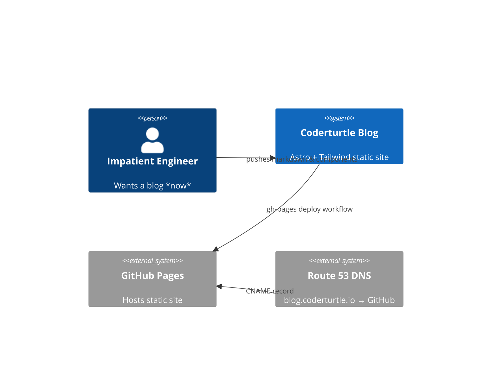

import TurtleTip from "@/components/TurtleTip.astro";

> *Architecting the unknown while reverse‑engineering life; perfection is a road, not a destination.*

---

## 0.&nbsp;Wait … **“Vibe‑Coding”**?

Picture an impatient engineer (👋 hi, that’s me) sitting at a desk desperately looking for that next dopamine hit. A wild idea appears:

> “I want a quirky blog with dark‑mode, Mermaid diagrams, shell‑green buttons … *today*.”
>
> — Me, a few hours ago

The old turtle would research Astro, Tailwind, GitHub Pages **in depth** before writing a single line of code. **Coderturtle** shrugs and says:

> “Let’s vibe‑code it with ChatGPT. We’ll correct course on the way.”

<TurtleTip>
<strong>Turtle Tip #1 — Vibe‑Coding in 20 words</strong><br/>
Treat the AI as your rubber‑duck pair‑programmer. Let it draft boilerplate; you keep the steering wheel & sanity‑checks.
</TurtleTip>

---

## 1.&nbsp;Real‑Time Ping‑Pong ⏱️

**Workflow in the shell:**

1. ✍️ *Describe* a component to ChatGPT → get code
2. 🛠️ *Paste* into VS Code → run `npm run dev`
3. 🚨 *Error*? copy‑paste stack trace back to the AI
4. 🔁 Repeat until browser stops screaming

### A Live Example — the Tailwind integration fiasco

```bash
> npm install @tailwindcss/vite
> astro dev
[vite] ✨  ready in 304ms
[vite] ssr error: Cannot find module '@astrojs/tailwind'
```

ChatGPT (politely but **incorrectly**) insisted the package was `@astrojs/tailwind`. After three rounds of 404s I went "old‑school": opened Astro 5 docs, realised **Tailwind is built‑in**, toggled `syntaxHighlight` instead and moved on.

<TurtleTip>
<strong>Turtle Tip #2 — When Vibe‑Coding Slows You Down</strong><br/>
If the AI repeats the *same* wrong answer twice, **pause and read the docs**. It’s faster than vibe‑looping.
</TurtleTip>

---

## 2.&nbsp;Architecture Snapshot 🔍

Below is a **C4 context diagram** showing how everything glues together.



And a **component view** zooming into the repo:

```mermaid
C4Component
Container(coderturtleSite, "Astro Site", "Node", "Builds & ships HTML/CSS/JS")
Component(content, "Content Collection", "MDX", "Blog & Library posts")
Component(layouts, "Layouts", "Astro Components", "Site chrome, header, footer")
Component(workflow, "GitHub Action", "YAML", "Build + Deploy to gh‑pages")

Rel(dev, content, "Writes")
Rel(content, coderturtleSite, "import")
Rel(layouts, coderturtleSite, "wraps")
Rel(coderturtleSite, workflow, "trigger build")
```

<TurtleTip>
<strong>Turtle Tip #3 — Mermaid in Astro</strong><br/>
Install <code>astro‑mermaid</code> once; every fenced block with <code>```mermaid</code> renders magically. Add <code>@apply</code> styles for dark‑mode polish.
</TurtleTip>

---

## 3.&nbsp;Tech Stack & Why 🛠️

| Layer | Tech | Why It Worked for Vibe‑Coding |
|-------|------|--------------------------------|
| **SSG** | **Astro 5** | Zero JS by default; MDX collections validate front‑matter; builds less than300 ms. |
| **Styling** | **Tailwind 3 + Shell Palette** | Utility classes = brain autocomplete. No CSS files, no BEM debates. |
| **Syntax** | **Shiki (Ayu Mirage)** | Compliments turtle colors, dark‑mode friendly. |
| **Diagrams** | **Mermaid** | Code‑as‑diagram; live‑editable in MDX. |
| **Deploy** | **GitHub Pages + Actions** | Free, automated, no infra yak‑shaving. |
| **DNS** | **Route 53** | Single CNAME, done. |

<TurtleTip>
<strong>Turtle Tip #4 — Keep “Oldschool” Tools Handy</strong><br/>
When GitHub Action YAML fails, hop to the official docs or action READMEs. AI hallucinations love outdated syntax.
</TurtleTip>

---

## 4.&nbsp;Process Reflection 🪞

| Phase | AI Vibes | Human Muscle |
|-------|----------|--------------|
| Scaffold layouts | 90 % | 10 % naming tweaks |
| Fix build errors | 60 % | 40 % StackOverflow + docs |
| Content writing | 80 % | 20 % turtle jokes |
| GitHub Actions | 30 % | 70 % manual doc reading |

The moment the AI looped on that deprecated Tailwind plugin, I **switched gears**. Traditional docs saved the sprint. *Lesson*: vibe‑coding accelerates unknown unknowns, but **still needs a steering shell**.

### Others agree …

> *“ChatGPT got me to a working Next.js build in minutes, but I still had to debug the ESLint config by hand.”* — Developer @ Hacker News¹

> *“Great for scaffolding, dangerous for auth.”* — Bloggers @ Dev.to²

(Links in the footnotes.)

<TurtleTip>
<strong>Turtle Tip #5 — Reading‑Time Front‑Matter</strong><br/>
Use <code>npm i reading‑time</code> in a prebuild step and shove the minutes into front‑matter for easy display.
</TurtleTip>

---

## 5.&nbsp;Sample Code — Prompt Engineering in Practice

```ts title="scripts/vibePrompt.ts"
const prompt = `You are Coderturtle, an eccentric but reliable AI pair‑programmer.\n
Generate an Astro layout with dark mode, Tailwind, and a turtle‑green accent.`;

const response = await openai.chat.completions.create({
  model: "gpt-4o",
  messages: [{ role: "user", content: prompt }]
});

console.log(response.choices[0].message.content);
```

<TurtleTip>
<strong>Turtle Tip #6 — Prompt Layers</strong><br/>
• **Role** → persona instructions (“eccentric but reliable”).<br/>
• **Task** → what you need generated.<br/>
• **Constraints** → file paths, color palette, versions.<br/>
Iterate fast; commit final prompt to git.
</TurtleTip>

---

## 6.&nbsp;Lessons Learnt

1. **AI scaffolds ≠ production‑grade.** Expect refactors.
2. **Mermaid wins** for architecture notes — but keep diagrams minimal.
3. **Shiki themes matter** — Ayu Mirage blends with our shell palette.
4. **Reading docs isn’t dead**; it’s just postponed until hallucination fatigue kicks in.
5. **Perfection is a road, not a destination** — iterate like a turtle: steady, curious, relentless.

---

## 7.&nbsp;Where Next? 🛤️

We vibed a hobby‑grade site in hours. To ship enterprise‑grade software we’ll need **context engineering**: domain models, stricter prompts, tests, budgets. Coming soon to the turtle log!

Until then, keep your shell polished and your stack traces short. 🐢

---

¹ <https://news.ycombinator.com/item?id=37815219><br/>
² <https://dev.to/ajcwebdev/gpt‑coding‑pitfalls‑52bm>
